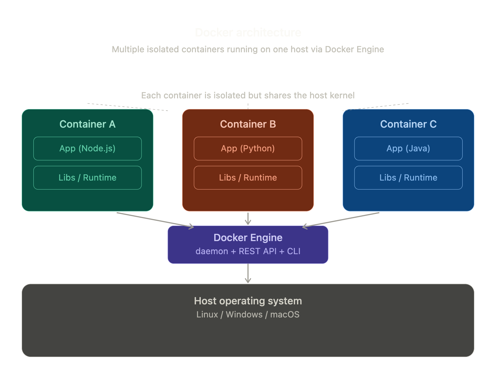

### What is Docker ?

Docker is an open-source platform that lets you package, ship, and run applications in isolated environments called containers.
Think of it as a lightweight, self-contained box that holds your app and everything it needs to run — code, runtime, libraries, configs — so it behaves identically on any machine.
Before Docker, developers constantly hit the "it works on my machine" problem. Docker solves this by making environments reproducible and portable.
#### Interview Answer
Docker is an open-source platform that helps you build, run, and manage containers. 
It simplifies the process of packaging applications into containers and provides tools to deploy and scale them easily.
### What is container ?
A container is a runnable instance of a Docker image. It is:
* Isolated — has its own filesystem, network, and process space.
* Lightweight — shares the host OS kernel (unlike VMs which emulate full hardware).
* Ephemeral — can be created, stopped, and destroyed in seconds.
* Portable — runs the same on a laptop, a server, or the cloud.

Container is a software that help us to run the same software image on a different operating system.For example as postgres has different versions for mac, windows and linux but with the help of container we can use the same image on different operating system.
Advantages are: Easy to manage, make testing easier and deployment faster.

#### Interview answer
A container is a lightweight, standalone package that includes everything needed to run an application — code, runtime, libraries, and settings. 
It ensures the app runs consistently across any environment, whether it's a developer's laptop or a production server.
### Core Docker Concepts
* Image — a read-only template/blueprint (built from a Dockerfile)
* Container — a running instance of an image
* Dockerfile — a script of instructions to build an image
* Registry — a storage hub for images (e.g. Docker Hub)
* Volume — persistent storage that survives container restarts
* Network — virtual network allowing containers to communicate
### All Essential Docker Commands
* Installation & Info
```
docker --version              # Check Docker version
docker info                   # System-wide info
docker help                   # List all commands
```
* Images
```
docker pull nginx                        # Download image from Docker Hub
docker images                            # List all local images
docker image ls                          # Same as above
docker build -t myapp:1.0 .              # Build image from Dockerfile (. = current dir)
docker build -t myapp:1.0 -f MyDockerfile .  # Build with custom Dockerfile
docker tag myapp:1.0 myapp:latest        # Tag an image
docker push myrepo/myapp:1.0             # Push image to registry
docker rmi nginx                         # Remove an image
docker image prune                       # Remove unused images
docker image inspect nginx               # Detailed image info
docker save myapp > myapp.tar            # Export image to tar
docker load < myapp.tar                  # Import image from tar
docker history myapp                     # Show image layers
```
* Containers — Run
```
docker run nginx                         # Run container (foreground)
docker run -d nginx                      # Run detached (background)
docker run -it ubuntu bash               # Interactive terminal
docker run --name mycontainer nginx      # Give container a name
docker run -p 8080:80 nginx              # Map host port 8080 → container port 80
docker run -P nginx                      # Map all exposed ports automatically
docker run -v /host/path:/container/path nginx  # Mount volume
docker run -e MY_VAR=value nginx         # Set environment variable
docker run --env-file .env nginx         # Load env vars from file
docker run --rm nginx                    # Auto-remove container when it exits
docker run --network mynet nginx         # Connect to specific network
docker run --memory 512m --cpus 1.5 nginx  # Resource limits
docker run -d --restart always nginx     # Always restart on failure/reboot
```
* Containers — Manage
```
docker ps                        # List running containers
docker ps -a                     # List all containers (including stopped)
docker ps -q                     # List only container IDs
docker stop mycontainer          # Gracefully stop container
docker kill mycontainer          # Force-kill container
docker start mycontainer         # Start a stopped container
docker restart mycontainer       # Restart container
docker pause mycontainer         # Pause processes in container
docker unpause mycontainer       # Resume container
docker rm mycontainer            # Remove stopped container
docker rm -f mycontainer         # Force remove running container
docker container prune           # Remove all stopped containers
docker rename old_name new_name  # Rename container
```
* Containers — Inspect & Debug
```
docker logs mycontainer              # View container logs
docker logs -f mycontainer           # Follow/stream live logs
docker logs --tail 100 mycontainer   # Last 100 lines
docker exec -it mycontainer bash     # Open shell inside running container
docker exec mycontainer ls /app      # Run command in container
docker inspect mycontainer           # Detailed JSON info
docker stats                         # Live resource usage (CPU, memory)
docker stats mycontainer             # Stats for specific container
docker top mycontainer               # Show running processes inside
docker diff mycontainer              # Show filesystem changes
docker port mycontainer              # List port mappings
docker cp mycontainer:/app/file.txt ./  # Copy file from container
docker cp ./file.txt mycontainer:/app/  # Copy file into container
docker wait mycontainer              # Wait for container to stop, print exit code
```
* Volumes
```
docker volume create myvol           # Create a named volume
docker volume ls                     # List volumes
docker volume inspect myvol          # Volume details
docker volume rm myvol               # Remove volume
docker volume prune                  # Remove unused volumes
docker run -v myvol:/data nginx      # Mount named volume
docker run --mount source=myvol,target=/data nginx  # Alternative mount syntax
```
* Networks
```
docker network create mynet           # Create a network
docker network ls                     # List networks
docker network inspect mynet          # Network details
docker network connect mynet mycontainer    # Connect container to network
docker network disconnect mynet mycontainer # Disconnect container
docker network rm mynet               # Remove network
docker network prune                  # Remove unused networks
```
* Docker Compose
```
docker compose up                    # Start all services (foreground)
docker compose up -d                 # Start detached
docker compose up --build            # Rebuild images before starting
docker compose down                  # Stop and remove containers/networks
docker compose down -v               # Also remove volumes
docker compose ps                    # List running services
docker compose logs                  # View all service logs
docker compose logs -f web           # Follow logs for "web" service
docker compose exec web bash         # Shell into a service
docker compose build                 # Build/rebuild services
docker compose pull                  # Pull latest images
docker compose restart               # Restart all services
docker compose stop                  # Stop without removing
docker compose start                 # Start stopped services
docker compose config                # Validate and view compose file
docker compose run web python test.py  # Run one-off command in service
```
* System Cleanup
```
docker system df                     # Show disk usage
docker system prune                  # Remove all unused data
docker system prune -a               # Also remove unused images
docker system prune --volumes        # Also remove unused volumes
```
* Dockerfile — Key Instructions
```
FROM ubuntu:22.04          # Base image
LABEL maintainer="you"     # Metadata
WORKDIR /app               # Set working directory
COPY . .                   # Copy files from host to image
ADD archive.tar /app       # Copy + auto-extract tars
RUN apt-get install -y python3  # Run command during build
ENV PORT=3000              # Set environment variable
EXPOSE 3000                # Document the port (doesn't publish it)
VOLUME ["/data"]           # Declare mount point
USER appuser               # Switch to non-root user
ENTRYPOINT ["node"]        # Main executable (not overridable by default)
CMD ["server.js"]          # Default arguments (overridable with docker run)
HEALTHCHECK --interval=30s CMD curl -f http://localhost/ || exit 1
ARG BUILD_VERSION          # Build-time variable (not available at runtime)
ONBUILD COPY . /app        # Trigger instruction for child images
```
* docker-compose.yml — Example
```
version: "3.9"
services:
  web:
    build: .
    ports:
      - "8080:80"
    environment:
      - NODE_ENV=production
    volumes:
      - ./app:/app
    depends_on:
      - db
    restart: always

  db:
    image: postgres:15
    volumes:
      - pgdata:/var/lib/postgresql/data
    environment:
      POSTGRES_PASSWORD: secret

volumes:
  pgdata:
```
* Quick Reference Cheatsheet
```
Task                   Command
Run & enter container - docker run -it ubuntu bash
Run in background - docker run -d -p 8080:80 nginx
See running containers - docker ps
Stop a container - docker stop <name>
View logs - docker logs -f <name>
Shell into running container - docker exec -it <name> bash
Build image - docker build -t myapp 
Remove everything unused - docker system prune -a
```